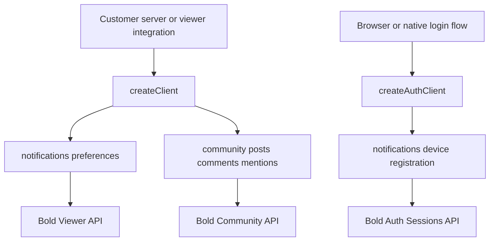
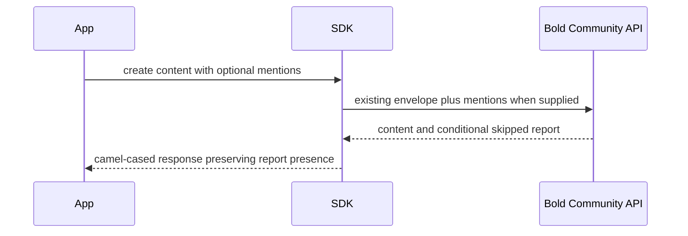

# Community Notifications and Mentions SDK Surface - Plan

## Goal Capsule

- **Objective:** Expose the non-admin BOLD-1751 notification, mention, and device-registration API surface through the existing tenant-key and runtime-auth clients without breaking current community callers.
- **Authority:** BOLD-1751 and the published Bold OpenAPI contract define behavior; this repository's client factories, camel-case response convention, tests, and release workflow define implementation shape.
- **Execution profile:** Extend the existing functional factories and Axios helpers, add public types and runtime smoke coverage, update consumer documentation, and include a minor Changeset.
- **Stop conditions:** Stop if the published Bold contract differs from BOLD-1751 in a way that changes authentication, response envelopes, or compatibility guarantees.
- **Tail ownership:** The feature PR carries the Changeset; the automated release PR owns version and changelog updates.

---

## Product Contract

### Summary

Add notification preferences, community mentions, and authenticated device registration to the SDK while preserving existing response bodies for community create calls that do not send mentions.

### Problem Frame

The Bold backend has shipped the community notification phases described by BOLD-1751, but `@boldvideo/bold-js` is hand-maintained and does not derive its public surface from `openapi.json`. Consumers cannot currently manage notification channels, send or read mentions, or register push tokens through the SDK.

The endpoints span two existing authentication boundaries. Notification preferences and community calls use the tenant API-key client, while device registration uses the runtime auth client with the customer's upstream JWT and tenant slug.

### Requirements

**Notification preferences**

- R1. The tenant-key client must get a viewer's notification preferences and partially update the `email` and `push` channel switches without inventing values for an omitted channel.

**Mentions**

- R2. Existing post and comment create inputs must accept an optional `mentions` array of customer external IDs and send it inside the existing resource envelope.
- R3. A create response must expose `mentions.skipped` only when the caller supplied the `mentions` parameter; calls without it must retain their existing wire response.
- R4. The community namespace must list a viewer's mentions with pagination and expose the always-present post ID, nullable comment ID, nullable excerpt, author, timestamps, and read state.
- R5. The community namespace must return the viewer's unread mention count and mark either selected mention IDs or all unread mentions as read.
- R6. Mention IDs that are malformed, unrecorded, or beyond the 25-ID cap may appear in `skipped`; self-mentions and duplicates are omitted silently, and a bad mention must not fail post or comment creation.

**Device registration**

- R7. The runtime auth client must register an `expo`, `fcm`, or `apns` token against an authenticated session and return the camel-cased registration envelope.
- R8. The expected `session_management_unavailable` 403 response must be distinguishable through an exported typed error while retaining the status, server code, retryability, and original Axios error.

**Compatibility, documentation, and release**

- R9. Existing public methods and exports must remain source-compatible for ESM and CommonJS consumers.
- R10. New public methods, types, authentication placement, response caveats, and integration examples must be documented in both `README.md` and `llms.txt`.
- R11. The feature PR must include a minor Changeset and must not directly bump `package.json` or edit `CHANGELOG.md`.

### Key Flows

- F1. Notification preference update
  - **Trigger:** A tenant-key integration changes one or both notification channels for a known viewer.
  - **Actors:** Customer server, tenant-key client, Bold Viewer API.
  - **Steps:** The integration passes the viewer ID and partial channels; the SDK sends only provided channel fields; the SDK camelizes and returns the complete stored channel state.
  - **Outcome:** The omitted channel remains unchanged.
  - **Covered by:** R1
- F2. Community create with mentions
  - **Trigger:** A viewer creates a post or comment and supplies external IDs to mention.
  - **Actors:** Viewer-facing integration, tenant-key client, Bold Community API.
  - **Steps:** The SDK preserves the existing content envelope and adds the supplied mention array; Bold creates the content and processes mentions transactionally; the SDK returns content plus the skipped-ID report.
  - **Outcome:** Content creation succeeds even when some mention IDs are skipped.
  - **Covered by:** R2, R3, R6
- F3. Mention inbox lifecycle
  - **Trigger:** A viewer opens an inbox, reads its badge count, or marks mention rows read.
  - **Actors:** Viewer-facing integration, tenant-key client, Bold Community API.
  - **Steps:** The SDK sends `X-Viewer-ID`; list and count responses are camelized; the caller marks selected IDs or all unread rows.
  - **Outcome:** Every inbox row remains deep-linkable through `postId`, and the read response returns both changed and remaining counts.
  - **Covered by:** R4, R5
- F4. Push token registration after login
  - **Trigger:** Runtime session creation or challenge verification returns a session ID.
  - **Actors:** Browser or native app, runtime auth client, Bold Auth Sessions API.
  - **Steps:** The app passes the session ID and provider/token pair; the SDK reuses runtime auth headers; Bold stores or replaces the session's push token.
  - **Outcome:** Registration succeeds, or session-management unavailability is surfaced as an expected typed state.
  - **Covered by:** R7, R8

### Acceptance Examples

- AE1. **Covers R1.** Given both channels are enabled, when the caller updates only `email` to false, then the request contains no `push` key and the response reports `email: false` with the stored push value.
- AE2. **Covers R2 and R3.** Given an existing post create call without `mentions`, when it succeeds, then the request and response remain unchanged from the current SDK behavior.
- AE3. **Covers R2, R3, and R6.** Given a create call with an empty or populated `mentions` array, when it succeeds, then the request carries that array and the response type exposes the returned `skipped` list.
- AE4. **Covers R4 and R5.** Given a comment mention, when the viewer lists and marks it read, then the row includes the parent post ID and the read response reports `markedRead` and the resulting `unreadCount`.
- AE5. **Covers R7 and R8.** Given session management is off, when the app registers a device, then it can catch the exported unavailable-error type and inspect code `session_management_unavailable` with `retryable: false`.

### Scope Boundaries

- Admin community import endpoints are excluded because this repository has no admin-key client; BOLD-1751 makes that surface conditional.
- Backend feature flags, delivery workers, notification rendering, and push-provider delivery are outside this SDK change.
- The SDK does not parse content for handles, resolve external IDs, sanitize mention excerpts, or enforce the backend's mention cap locally.
- Package version and changelog edits are deferred to the automated Changesets release PR.

### Success Criteria

- All new request paths, headers, resource envelopes, omitted-field behavior, response camelization, and typed errors have runtime smoke coverage.
- TypeScript compilation, ESM/CJS builds, and the full Node test suite pass.
- Consumer documentation and `llms.txt` describe the same public surface.
- A minor Changeset summarizes the release-facing capability.

---

## Planning Contract

### Key Technical Decisions

- KTD1. **Preserve the two client authentication boundaries.** Tenant API-key operations stay on `createClient`, and device registration stays on `createAuthClient`, because the endpoints require different credentials and controlled headers. A combined client or credential-switching method would weaken the existing separation and make browser-safe runtime use harder to reason about. Governs R1, R4, R5, R7, and R8.
- KTD2. **Follow existing request/response conversion.** Request bodies use explicit snake-case wire keys, and all responses pass through `camelizeKeys`; this matches `src/lib/community.ts`, `src/lib/auth.ts`, and the rest of the SDK. Returning raw OpenAPI field names would create a second casing convention in the public API. Governs R1-R8.
- KTD3. **Specialize the expected runtime-auth failure by server code.** Add an exported subclass for `session_management_unavailable` while enriching the base auth error with machine-readable server fields. Matching only status 403 would conflate disabled session management with unrelated authorization failures, while replacing `AuthAPIError` would break existing error-family checks. Governs R8 and R9.
- KTD4. **Keep mention compatibility conditional at the wire boundary.** Optional mention inputs serialize only when supplied, including an explicit empty array, and response types model the conditional `mentions` report without changing content objects. Always sending an empty array or always synthesizing a report would violate the backend's presence contract and byte compatibility. Governs R2, R3, R6, and R9.
- KTD5. **Keep backend validation authoritative.** The SDK validates required arguments and mutually exclusive read modes but does not duplicate provider-token syntax, external-ID syntax, UUID ownership, or the mention cap. Duplicating backend rules would drift from the published contract and could reject inputs the API later accepts. Governs R5-R8.
- KTD6. **Use the normal Changesets release train.** A minor Changeset ships with the feature PR; versioning and changelog generation remain automated after merge. A manual version bump would conflict with the repository's release PR automation. Governs R11.

### Assumptions

- Expose preference methods under `createClient(...).notifications`, device registration under `createAuthClient(...).notifications`, and inbox methods under the existing `community.mentions` namespace.
- Name inbox operations `list`, `unreadCount`, and `markRead`; use an exclusive TypeScript union for selected IDs versus all mentions.
- Add focused Node HTTP smoke tests rather than introducing a new test dependency or generator.

### High-Level Technical Design

**Client and endpoint ownership**

**Conditional mention response**

**Public namespace placement**

| Client | Namespace | Capability | Authentication |
|---|---|---|---|
| `createClient` | `notifications` | Get and update viewer preferences | Tenant API key |
| `createClient` | `community.mentions` | List, count, and mark mentions read | Tenant API key plus viewer header |
| `createClient` | Existing community create methods | Optional mention external IDs | Tenant API key plus viewer header |
| `createAuthClient` | `notifications` | Register a provider token on a session | Upstream JWT plus tenant slug |

### Risks & Dependencies

- **External contract drift:** The API is maintained in `BOLD_admin`; mitigate drift with request-capture tests for every path, header, envelope, omitted key, and camel-cased response used by this plan.
- **Public error compatibility:** `AuthAPIError` is already exported; keep the unavailable subclass within that inheritance chain, make new metadata additive, and test both specialized and ordinary 403/404 cases.
- **Sensitive device tokens:** Provider tokens must never enter validation messages, SDK logs, or thrown message text; tests should use a recognizable token and assert it is absent from failure messages while preserving the explicitly supported `originalError`.
- **Viewer authority:** The SDK forwards caller-supplied viewer IDs but does not authorize them; retain the existing `X-Viewer-ID` pattern and rely on Bold's tenant/viewer scoping rather than adding client-side trust claims.
- **Untrusted excerpts:** Mention excerpts are unsanitized API content; expose them as nullable strings and document that rendering clients must escape or sanitize them.
- **Hand-maintained parity:** The repository has no generated API layer; treat runtime methods, public exports, `README.md`, `llms.txt`, and smoke tests as one change set.
- **Release configuration mismatch:** `@changesets/cli` configuration says restricted while `package.json` publishes publicly; preserve current configuration and add only the release note so this feature does not alter publishing policy.

---

## Implementation Units

### U1. Public notification and mention type contracts

- **Goal:** Define and export the request, response, entity, and error metadata types required by the new surface.
- **Requirements:** R1-R9; KTD2-KTD4.
- **Dependencies:** None.
- **Files:** `src/lib/types.ts`, `src/lib/auth.ts`, `src/index.ts`, `test/community-notifications.test.mjs`, `test/auth-sessions.test.mjs`.
- **Approach:**
  1. Add response-complete and update-partial notification channel types.
  2. Add mention inbox, skipped-report, create-response, pagination option, read-target, and read-response types.
  3. Add device-provider, registration input/response, and machine-readable auth error fields.
  4. Export every public type and the specialized unavailable-error class from `src/index.ts`.
- **Patterns to follow:** Existing grouped API types in `src/lib/types.ts`, public type re-exports in `src/index.ts`, and custom error classes in `src/lib/auth.ts`.
- **Test scenarios:**
  1. Type declarations build for both module formats and expose the new public names.
  2. Runtime tests in U2-U4 prove the typed shapes match camel-cased responses and error instances.
- **Verification:** Type checking and declaration generation succeed without removing or narrowing an existing export.

### U2. Notification preference client

- **Goal:** Add tenant-key methods for reading and partially updating viewer notification channels.
- **Requirements:** R1, R9; KTD1, KTD2.
- **Dependencies:** U1.
- **Files:** `src/lib/notifications.ts`, `src/lib/client.ts`, `test/community-notifications.test.mjs`.
- **Approach:**
  1. Create a small functional notification factory with GET and PATCH helpers that wrap errors consistently with other tenant-key modules.
  2. Encode the viewer ID in the path, send the `channels` envelope, and omit undefined channel fields.
  3. Mount the factory on the tenant-key client's `notifications` namespace.
- **Execution note:** Start with HTTP smoke assertions for path, method, body omission, error wrapping, and response camelization.
- **Patterns to follow:** Factory composition in `src/lib/session-management.ts`, Axios error wrapping in `src/lib/community.ts`, and `camelizeKeys` response handling.
- **Test scenarios:**
  1. Covers AE1. GET sends the encoded viewer path and returns both camel-cased channel switches.
  2. Covers AE1. PATCH with only `email` sends no `push` key and returns the server's complete channel state.
  3. Missing viewer IDs fail before a request is sent.
  4. A server error is wrapped with its HTTP status and machine-readable server message.
- **Verification:** The new namespace behaves through the built ESM entry point and all request-capture assertions pass.

### U3. Community create mentions and mention inbox

- **Goal:** Extend current community methods with optional mentions and add inbox list/count/read operations.
- **Requirements:** R2-R6, R9; KTD1, KTD2, KTD4.
- **Dependencies:** U1.
- **Files:** `src/lib/community.ts`, `src/lib/client.ts`, `test/community-notifications.test.mjs`.
- **Approach:**
  1. Add mention arrays to the existing post and comment resource bodies without changing calls that omit them.
  2. Reuse community GET/POST helpers and viewer headers for inbox methods.
  3. Map `pageSize` to `page_size` and validate that mark-read receives exactly one supported mode.
- **Execution note:** Characterize existing create request bodies first, then add the mention-present cases so byte compatibility is visible.
- **Patterns to follow:** Existing `community.posts` and `community.comments` method factories, `toQuery`, `requireViewerId`, and `PaginatedResponse`.
- **Test scenarios:**
  1. Covers AE2. Post and comment creates without `mentions` retain their current JSON bodies and return content-only envelopes.
  2. Covers AE3. Post and comment creates with a populated array send external IDs and return camel-cased `mentions.skipped`.
  3. Covers AE3. An explicitly empty array remains present on the wire and exposes the server's empty skipped report.
  4. Covers AE4. Listing sends viewer headers and pagination query parameters, and camelizes post, comment, author, and read fields.
  5. Unread count sends the viewer header and returns the numeric count envelope.
  6. Covers AE4. Selected-ID and all-unread mark operations send their exclusive bodies and return `markedRead` plus `unreadCount`.
  7. Missing viewer IDs or an invalid read target fail before a request is sent.
- **Verification:** Existing community behavior remains green and every new inbox endpoint is exercised through the built SDK.

### U4. Runtime device registration and typed unavailable error

- **Goal:** Register push tokens on authenticated sessions and make the expected disabled-account response catchable by type.
- **Requirements:** R7-R9; KTD1-KTD3.
- **Dependencies:** U1.
- **Files:** `src/lib/auth.ts`, `test/auth-sessions.test.mjs`.
- **Approach:**
  1. Reuse runtime auth header construction and POST transport for the session device path.
  2. Validate session ID, provider, and token before sending; preserve request-level auth overrides.
  3. Capture server `code` and `retryable` fields on auth errors and throw the specialized subclass for the unavailable response.
- **Execution note:** Add a failing typed-error assertion before changing the shared auth error wrapper.
- **Patterns to follow:** Existing `createAuthClient().sessions` methods, controlled auth headers, URL encoding, and `AuthAPIError`.
- **Test scenarios:**
  1. Registration sends the encoded session path, provider/token body, bearer JWT, and tenant slug, then camelizes `sessionId`.
  2. Request-level JWT and tenant overrides continue to work for registration.
  3. Missing session ID, provider, or token fails before a request is sent.
  4. Covers AE5. A 403 carrying `session_management_unavailable` throws the exported specialized error with status, code, `retryable: false`, and original error.
  5. Other 403 and 404 responses remain ordinary `AuthAPIError` instances.
- **Verification:** Auth session tests pass and existing auth methods retain their error behavior.

### U5. Consumer documentation and release metadata

- **Goal:** Document the new integration surface and prepare it for the normal minor release train.
- **Requirements:** R10, R11; KTD6.
- **Dependencies:** U2-U4.
- **Files:** `README.md`, `llms.txt`, `.changeset/<generated-name>.md`.
- **Approach:**
  1. Document tenant notification preferences, mention create/inbox usage, runtime device registration after session creation, and the typed unavailable state.
  2. Keep `README.md` and `llms.txt` method names and type summaries aligned.
  3. Add one minor Changeset for `@boldvideo/bold-js` without modifying the current package version or changelog.
- **Patterns to follow:** Existing Community API and Session Management documentation sections and recent feature Changesets.
- **Test scenarios:** Test expectation: none — documentation and release metadata do not add runtime behavior; public examples are checked against built declarations and method names.
- **Verification:** Documentation references only exported APIs, the Changeset targets the correct package with a minor bump, and no release-generated files changed.

---

## Verification Contract

| Gate | Scope | Done signal |
|---|---|---|
| `pnpm run lint` | U1-U4 | Strict TypeScript checking passes. |
| `pnpm test` | U1-U4 | The package builds and every Node HTTP smoke test passes. |
| `pnpm run build` | U1-U5 | ESM, CommonJS, and declaration outputs generate successfully. |
| `pnpm changeset status` | U5 | The pending minor release note is recognized for `@boldvideo/bold-js`. |
| `git diff --check` | All units | No whitespace or patch-format errors remain. |

---

## Definition of Done

- R1-R11 are implemented or explicitly excluded by the Scope Boundaries.
- U1-U5 satisfy their test scenarios and verification outcomes.
- Existing community and auth callers remain compatible.
- New public methods and types are exported through the package entry point.
- `README.md` and `llms.txt` match the implemented API.
- The feature PR contains a minor Changeset but no direct version or changelog edit.
- Abandoned experiments, generated local artifacts, and unrelated working-tree changes are absent from the diff.

---

## Sources & Research

- [BOLD-1751](https://linear.app/boldvideo/issue/BOLD-1751/bold-js-expose-community-notification-admin-import-surface-bold-1747) defines the SDK scope and compatibility requirements.
- The `BOLD_admin` repository's `priv/static/openapi.json` defines the published request and response contracts for every included endpoint.
- `src/lib/community.ts`, `src/lib/auth.ts`, `src/lib/client.ts`, and `src/lib/types.ts` provide the current implementation patterns.
- `test/auth-sessions.test.mjs` and `test/session-management.test.mjs` establish the built-package HTTP smoke-test approach.
- `.github/workflows/changeset-release.yml`, `CONTRIBUTING.md`, and recent feature Changesets establish the release handoff.
